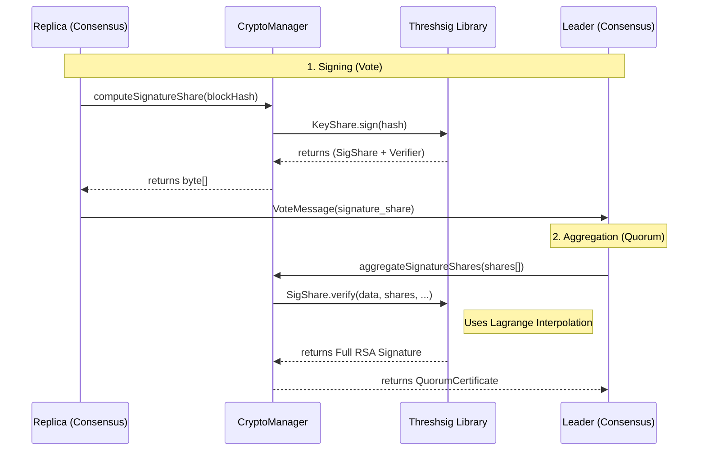

# Step 5 Core Components: Byzantine Fault Tolerance with RSA Threshold Signatures

Step 5 upgrades the HotStuff consensus from Step 3 (HMAC-based) to use **Non-Interactive RSA Threshold Signatures**. This achieves true Byzantine Fault Tolerance (BFT) by ensuring that a Quorum Certificate (QC) can only be formed if $n-f=3$ honest replicas participate in a single-round signing process.

| Component | Responsibility | What does it solve? |
| :--- | :--- | :--- |
| **`CryptoManager.java`** | Manages threshold keys and RSA operations. | **Key Isolation**: Each node only holds its private share. It abstracts the complex `threshsig` library calls into simple `computeSignatureShare` and `aggregateSignatureShares` methods. |
| **`ThresholdPKISetup.java`** | A standalone "Dealer" utility for key generation. | **Trust Bootstrap**: Generates the group modulus, distributes private shares to nodes, and exports the group public key. |
| **`Consensus.java` (Updated)** | Orchestrates the 1-round signing flow. | **BFT Consensus**: Replaces the single-replica vote with a threshold-protected interaction (Signature Shares $\rightarrow$ Aggregated Signature). |
| **`QuorumCertificate.java` (Updated)** | Holds a single RSA threshold signature. | **Efficiency**: Instead of $n-f$ individual signatures, it stores one aggregated signature, reducing message size and verification time. |

---

## 2. Key Concepts & Their Implementation

### 2.1 The 1-Round Threshold Signing Process
Our implementation uses **Shoup's RSA Threshold Signature Scheme**, which is **non-interactive**. To sign a message (e.g., a Phase + View + NodeHash), nodes perform only one communication round:

1.  **Voting Phase**: 
    - Each replica receives a proposal, verifies it, and computes a **signature share** using its private `node-X-threshold.key`.
    - The share is sent to the leader in a `VoteMessage`.
2.  **Aggregation Phase**:
    - The Leader collects $n-f$ shares. Since the scheme is non-interactive, the leader can immediately aggregate them into the final RSA signature.
    - This signature is then placed in a `QuorumCertificate` and broadcast to all replicas.

### 2.2 Threshold PKI (Public Key Infrastructure) Layout
We use $(t=3, n=4)$ parameters. This means we need 3 out of 4 nodes to sign.
- **`keys/threshold_public.key`**: The group public key used by all nodes (and clients) to verify QCs.
- **`keys/node-X-threshold.key`**: The unique private secret share for each node.

---

## 3. Protocol Message Changes (`consensus.proto`)

Unlike the interactive Ed25519 version, our RSA implementation is efficient and keeps messages simple:
- **`VoteMessage` Fields**:
    - `signature_share`: A single field carrying the partial RSA signature computed by a replica.
- **`QuorumCertificate`**: Now contains a single `bytes threshold_signature` which is the aggregated RSA signature.

---

## 4. Anatomy of the `threshsig` Library

The `ist.group29.depchain.server.crypto.threshsig` package contains the core mathematical implementation of Shoup's RSA Threshold Signature Scheme. These files are essential for the BFT logic and are integrated as follows:

### Core Library Components
| Class | Role | Integration Path |
| :--- | :--- | :--- |
| **`Dealer.java`** | The trusted entity that bootstraps the system. It generates the RSA group key and splits the secret using a polynomial. | Used by **`ThresholdPKISetup`** during the offline setup phase. |
| **`GroupKey.java`** | A public object containing $n, e, k, l$ parameters. It allows anyone to verify an aggregated signature. | Loaded by **`CryptoManager`** and shared across the network in the genesis config. |
| **`KeyShare.java`** | Each node's unique secret asset. It provides the `sign(data)` method to produce a partial signature. | Managed by **`CryptoManager`**; each node only has its own share (isolation). |
| **`SigShare.java`** | A payload representing a partial signature. Includes the static `verify()` method for aggregation. | Produced during VOTE phases in **`Consensus`**; aggregated into a full signature by the Leader. |
| **`Verifier.java`** | Auxiliary zero-knowledge proof data attached to each `SigShare`. | Used during aggregation to verify individual shares without revealing secrets. |
| **`Poly.java`** | Represents the secret $k-1$ degree polynomial $f(x)$. | Internal to `Dealer`; used only during key generation. |
| **`SafePrimeGen.java`** | Generates strong (Sophie Germain) primes for the RSA modulus. | Ensures the security of the underlying RSA parameters. |

---

## 5. Data & Control Flow

To understand the connection between the library and the project, we distinguish between the **Offline Setup** and **Runtime Consensus**.

### Phase A: Offline Setup (Key Distribution)
1.  Admin runs **`ThresholdPKISetup`**.
2.  `ThresholdPKISetup` instantiates the **`Dealer`**.
3.  `Dealer` generates the group key and $l=4$ **`KeyShare`** secret files.
4.  Admin distributes one `node-X-threshold.key` to each node and the `threshold_public.key` to everyone.

### Phase B: Runtime Consensus (Signing & Verification)


---

## 6. Verification & Testing

Our testing strategy follows a **layered approach**. We use `ConsensusTest.java` to verify the protocol's correctness under a variety of conditions, using mocks to isolate the consensus state machine from the expensive cryptographic math and network latency.

### 6.1 Protocol Verification (`ConsensusTest.java`)
We use Mockito to simulate successful (and failed) threshold signature operations. This allows us to strictly verify that the **HotStuff State Machine** behaves correctly according to the paper's specs.

- **`testLeaderRotation`**: Verifies that the mapping between views and leaders is deterministic and fair (round-robin). This is critical because every node must agree on who the leader is to successfully form a quorum.
- **`testSafeNodeSafetyRuleRejectsConflict`**: Tests the core safety property. It verifies that a node will **reject** a block on a conflicting chain unless that block can prove it has wider support (a fresher QC). This prevents "double-voting" and chain forks.
- **`testHappyPathLeaderCompletesOneView`**: The most important test. It simulates a perfect scenario where $n-f$ honest replicas exchange votes. It verifies that the leader correctly transitions from `PREPARE` $\rightarrow$ `PRE-COMMIT` $\rightarrow$ `COMMIT` $\rightarrow$ `DECIDE`.

### 6.2 Byzantine Fault Tolerance Edge Cases
Step 5 specifically targets BFT. We added tests that simulate malicious or unavailable nodes:

- **`testInsufficientSignatureShares`**: We simulate a "Silent replica" or a network partition where the leader only receives 2 shares. The system must **stall** rather than creating an invalid QC, ensuring $n-f=3$ is always maintained.
- **`testFaultySignatureShare`**: We simulate a "Byzantine replica" sending a corrupt signature share. The `CryptoManager` (verified by the leader) must reject the share using secondary RSA verification values ($v_i$). This prevents a single malicious node from corrupting the final aggregate signature.
- **`testEquivocationDetection`**: Ensures that nodes won't vote for two different proposals in the same view, which is the cornerstone of preventing leader equivocation.

### 6.3 How to Run
```bash
# Compile and install the project
mvn clean install -DskipTests 

# Run the consensus tests
mvn -pl server test -Dtest=ConsensusTest
```
