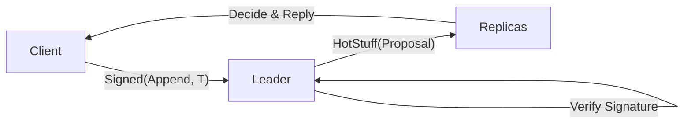

# Step 6: Client Library & Blockchain Integration Analysis

Step 6 marks the transition from a closed consensus engine to a functional, client-accessible blockchain service. This document analyzes the implementation of the Client Library, the "Admission Control" for client requests, and the full request-response lifecycle in the HotStuff protocol.

| Component | Responsibility | What does it solve? |
| :--- | :--- | :--- |
| **`ClientLibrary.java`** | API for application-to-blockchain interaction. | **Abstraction**: Hides the complexity of network handshakes, broadcast, and quorum collection from the user application. |
| **`ClientRequest` Signing** | Integrity protection for user operations. | **Byzantine Resilience**: Prevents malicious nodes from forging, duplicating, or modifying client requests before they are proposed. |
| **Admission Control (Leader)** | Verification of client signatures. | **Spam & Forgery Protection**: Ensures that only authorized clients can propose commands to be appended to the blockchain. |
| **Response Path** | Notifying the client of execution. | **Reliability**: Provides the client with proof (from $f+1$ nodes) that their request is permanently committed. |

---

## 1. The Client-to-Node Lifecycle

The implementation of Step 6 completes the "full loop" of a blockchain transaction:

1.  **Request Construction**: The client application calls `append("data")`. The `ClientLibrary` wraps this into a `ClientRequest` (Protobuf), attaches a monotonic timestamp (for replay protection), and **signs** the entire bundle using the client's RSA private key.
2.  **Broadcast**: The request is sent to all blockchain members using the `LinkManager`. Even if the current leader is Byzantine, honest nodes receive the request and can ensure it eventually gets proposed (in Stage 2, using a mempool; in Stage 1, via direct broadcast).
3.  **Admission by Leader**: The leader receives the `ClientRequest`, verifies the RSA signature using the client's pre-distributed public key, and places it in a local buffer.
4.  **Proposal (HotStuff)**: When starting a new view, the leader picks a buffered `ClientRequest` to be the `command` for the next `HotStuffNode`.
5.  **Agreement**: The nodes run the 4-phase HotStuff protocol (Prepare → Pre-commit → Commit → Decide) on the block containing the client's request.
6.  **Upcall & Reply**: Once the block is `DECIDE`d, the consensus engine calls `Service.onDecide()`. The server then sends a `ClientResponse` back to the original client.
7.  **Quorum Confirmation**: The `ClientLibrary` collects responses. Once it hears from $f+1$ nodes, it knows the request is "stable" (since at least one honest node has decided the value. In a BFT system, if one honest node decides, the safety property of HotStuff ensures all other honest nodes will eventually decide the same.

---

## 2. Key Design Decisions & Implicit Requirements

### 2.1 Public Key Infrastructure (PKI) for Clients
As confirmed by the teacher, the "pre-distributed keys" assumption applies to clients as well. 
- **Server Discovery**: Nodes must load client public keys during startup to establish **Authenticated Perfect Links (APL)** with them. Without this, the server-side `LinkManager` would drop packets from unknown client IDs.
- **Client Identity**: Each client has a unique ID (e.g., `client-0`) and a corresponding `.p12` keystore.

### 2.2 Replay Protection
To prevent a Byzantine node from re-submitting an old client request, every `ClientRequest` includes a `timestamp`. Nodes should maintain a `highestSeenTimestamp` per client (similar to the sliding window in APL) to discard stale or duplicate requests.

### 2.3 Quorum Selection ($f+1$ vs $2f+1$)
- **Why $f+1$?** A client only needs $f+1$ replies to be certain of execution. Since there are at most $f$ Byzantine nodes, hearing from $f+1$ guarantees that at least one honest node has decided the value. In a BFT system, if one honest node decides, the safety property of HotStuff ensures all other honest nodes will eventually decide the same.

---

## 3. Current Implementation Status vs. Requirements

### ✅ Completed
- **`ClientLibrary` Core**: High-level `append()` API using `CompletableFuture`.
- **Quorum Tracking**: Logic to wait for $f+1$ node responses.
- **Client Keystore Support**: `App.java` and `ClientLibrary` correctly load RSA keys.
- **Protocol Envelopes**: `messages.proto` contains `ClientRequest` and `ClientResponse` types.

### 🛠️ Partially Completed / Issues Identified
- **Missing Request Signatures**: The `ClientRequest` proto lacks a `signature` field, and the library currently sends unsigned data. 
- **Server Discovery of Clients**: The server's `LinkManager` is currently only aware of other $N$ nodes. It must be updated to load the `client-X` public keys to allow receiving their signed UDP packets.
- **Consensus Integration**: The `Consensus.java` leader currently proposes dummy strings (`"cmd-view-X"`) instead of pulling from a client request buffer.
- **The "Gap" Implementation**: The trigger for sending replies from the `Service` back to the `ClientLibrary` needs to be finalized.

---

## 4. Summary of Cryptographic Safeguards
Step 6 completes the security model by adding **Client Authenticity** to the **Inter-node Integrity** established in Step 2 and the **Threshold-based Quorum Proofs** from Step 5.

